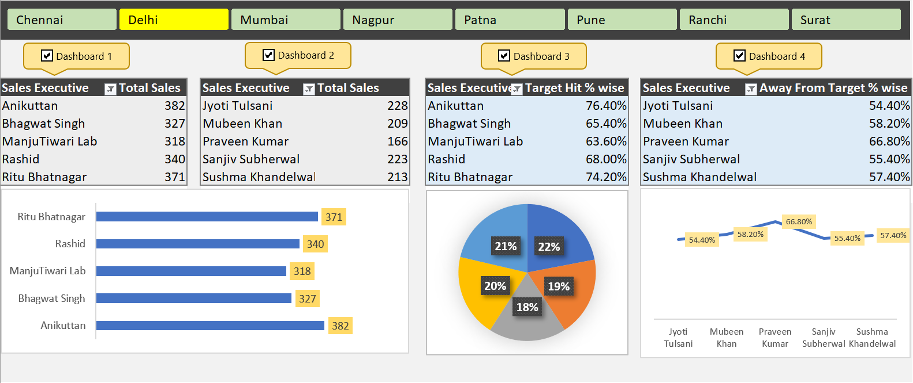

# 📊 Excel Sales Dashboard (End-to-End Project)

This is a fully functional Sales Dashboard built using Microsoft Excel. It covers everything from raw data to final visual reporting. The dashboard includes dynamic filters, pivot charts, and interactive elements with VBA for a seamless user experience.

---

## 📁 Project Structure

Excel-Sales-Dashboard/  
├── 01_Data/  
│   └── Raw Data.xlsm  
├── 02_Images/  
│   ├── Dashboard.png  
│   └── Raw Data.png  
├── 03_Dashboard/  
│   └── Complete Dashboard.xlsm  
└── README.md

### 📁 Folder Descriptions

- **📁 Dashboard** – Contains the final interactive Excel Dashboard (`Complete Dashboard.xlsm`)
- **📁 Data** – Contains the raw sales data used to build the dashboard (`Raw Data.xlsm`)
- **📁 Images** – Contains project screenshots used in README for visual reference

---

## 🧠 Project Objective

The aim of this project is to demonstrate Excel-based data analysis and dashboard creation from scratch using real-world techniques. It highlights the ability to:
- Work with large datasets
- Use pivot tables for summary insights
- Create interactive dashboards with filters
- Incorporate macros/VBA for usability

---

## 🔧 Tools & Techniques Used

- **Microsoft Excel**
- **Pivot Tables** for data aggregation
- **Pivot Charts** for visualization
- **Slicers** for filtering by Region, Date, etc.
- **VBA/Macros** for slicer reset buttons and usability enhancements
- **Conditional Formatting** for clean visuals

---

## 🖼️ Dashboard Preview

### 📊 Dashboard

---

### 🧾 Raw Data

---

## 🚀 How to Use

1. Scroll up and navigate to the [`Dashboard/`](./Dashboard) folder in this repository.
2. Download the Excel file (`Complete Dashboard.xlsm`) from there.
3. Open the file in **Microsoft Excel** (preferably 2016 or later).
4. If prompted:
   - Click **"Enable Editing"**
   - Click **"Enable Content / Enable Macros"**
5. Use the slicer buttons to filter by cities like Delhi, Mumbai, etc.
6. Explore dynamic visuals like:
   - Total Sales by Executive
   - Target Hit %
   - Pie Chart & Line Chart comparison
7. Click on reset buttons (if present) to clear filters.

> 💡 Tip: Macros/VBA must be enabled for full functionality.

---

